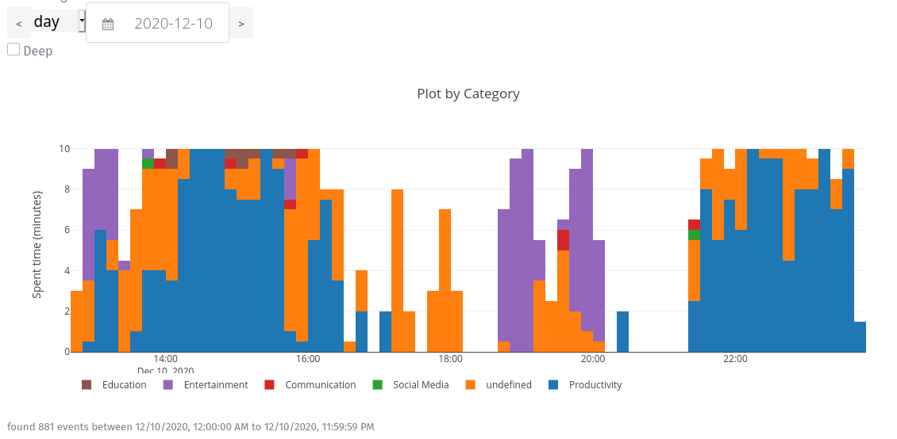
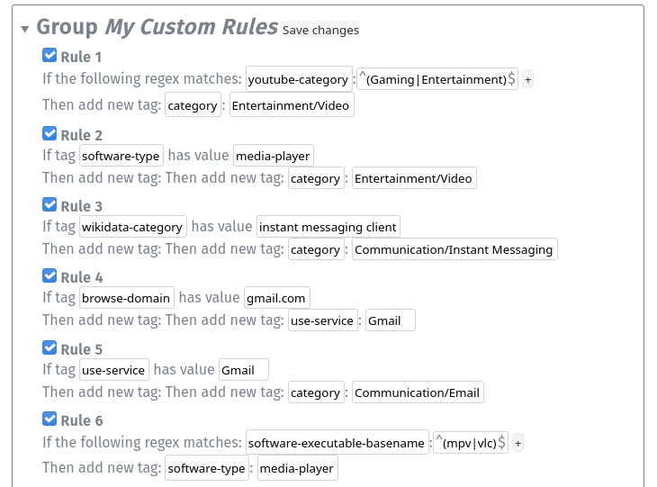

**How did you spend your day?**



**Track which projects you are working on and how much**


**Add your own custom classification rules...**



**...to get more detail**


# timetrackrs - an automatic rule-based time tracker

timetrackrs tracks what you spend your time on and stores it in a database. Inspired by [arbtt](https://arbtt.nomeata.de/), which I used previously.

Provides a Web UI to analyze it and create custom rules to improve the classification.

The user activity is tracked as "events", where each events has a timestamp, a duration, and a set of tags with values. You can think of tags as basically an extension of categories, allowing multiple category trees.

For example, an event can may have the following tags:

-   category:Productivity/Software Development/IDE
-   project:2021/timetrackrs
-   device:Home-PC

Which means in the UI you can figure out the time spent on software development, or on a specific project (not necessarily software development), or on a specific device.

## Data Sources

### Working Data Sources

-   Linux X11 tracking. Tracks the following properties:

    -   Which program is open (binary name)
    -   The window title
    -   Which file does the program have open (via cmd args)
    -   Connected WiFi (to be able to figure out rough location)
    -   Some stats about the system

    Adds the following intrinsic tags:

    -   software-window-title:...
    -   software-executable-path:...
    -   software-window-class:`<X11 window class>`
    -   software-opened-file:`<file path>`
    -   device-hostname:...

    and more.

-   [App Usage](https://play.google.com/store/apps/details?id=com.a0soft.gphone.uninstaller&hl=en) import

    Allows tracking which apps / app categories are used on your Android devices.

    -   device-hostname:...
    -   device-type:`<tablet or phone>`
    -   android-packageid:`<play store package id>`
    -   software-name:`<App Name>`
    -   device-os-type:Android

-   Browser Usage

    Tracks which websites / domains are used.

    -   For Firefox, install [Add URL to Window Title](https://addons.mozilla.org/en-US/firefox/addon/add-url-to-window-title/) and enable "Show the full URL"
    -   For Chromium-based browsers, install [URL in title](https://chrome.google.com/webstore/detail/url-in-title/ignpacbgnbnkaiooknalneoeladjnfgb?hl=en).

    Adds the following tags:

    -   browse-url:https://...
    -   browse-full-domain:news.ycombinator.com
    -   browse-domain:ycombinator.com

-   VS Code tracking

    Tracks which software development projects you spend your time on, as well as which files.

    To enable, open your user settings and set `window.title` to `${dirty}${activeEditorShort}${separator}${rootName}${separator}${appName}} 🛤sd🠚proj=${rootPath}🙰file=${activeEditorMedium}🠘 `

    Adds the following tags:

    -   software-development-project:`<project-path>`

-   [Sleep As Android](https://play.google.com/store/apps/details?id=com.urbandroid.sleep&hl=en&gl=US) import

    Imports data of when and how you slept from the Sleep app.

    Creates events with the following tags:

    -   physical-activity:sleeping

-   Timetrackrs import

    Imports data from a different timetrackrs database (e.g. from another device).

-   ZSH shell usage

    Adds the following tags:

    -   title-match-shell-cwd:`<current working directory>`
    -   title-match-shell-usr:`<current username>`
    -   title-match-shell-cmd:`<currently running program>`

    To enable, install [zsh-histdb](https://github.com/larkery/zsh-histdb), then add the following to your `.zshrc`:

    ```zsh
    # set window title for timetrackrs
    # adopted from https://github.com/ohmyzsh/ohmyzsh/blob/master/lib/termsupport.zsh
    autoload -Uz add-zsh-hook

    function title_precmd {
        title_preexec '' ''
    }
    function title_preexec {
        # http://zsh.sourceforge.net/Doc/Release/Expansion.html
        # http://zsh.sourceforge.net/Doc/Release/Prompt-Expansion.html#Prompt-Expansion
        local cwd="$(print -P '%~')"
        local user="$(print -P '%n@%m')"
        local LINE="$2"
        local cmd="$(print -P '%100>...>$LINE%<<')"

        title '' '{"t":"shell","cwd":${(qqq)cwd},"histdb":$HISTDB_SESSION,"usr":${(qqq)user},"cmd":${(qqq)cmd}}'
    }
    add-zsh-hook precmd title_precmd
    add-zsh-hook preexec title_preexec

    ```

### Todo Data Sources

-   Fix Windows data source
-   More detailed browser usage (which containers are used, how did you get to website X?). Needs own webextension
-   mpv usage via (which TV shows and movies watched), via own mpv tracking lua script `.config/mpv/scripts/logall.lua`
-   Google Fitness import via API
-   Manual entry UI to add start/stop times and categories by hand.

## External Info Fetchers

Timetrackrs supports fetching additional information from external sources.

Currently, the following are implemented:

-   Youtube Meta Fetcher

    Fetches some metadata when watching videos like the youtube category (Music / Educational / Entertainment / etc) and the channel.
    Adds the following tags:

    -   youtube-channel:`<uploader channel id>`
    -   youtube-channel-name:`<uploader username>`
    -   youtube-tag:`<tag-value>` for each tag
    -   youtube-category:`<category>` for each video category

-   Wikidata fetcher

    For each domain visited, tries to get some info about that domain from Wikidata. Adds the following tags.

    Adds the following tags when visiting e.g. reddit.com:

    -   wikidata-label:Reddit
    -   wikidata-id:Q1136
    -   wikidata-category:social networking service
    -   wikidata-category:social-news website
    -   wikidata-category:mobile app

## General Todo

-   Make it easier to setup:

    -   Create a single binary that starts server, api handler and tracking
    -   Create installable systemd service [timetrackrs.service](timetrackrs.service)

-   Look at similar tools, e.g. https://www.raymond.cc/blog/check-application-usage-times-personal-activity-monitor/ , activitywatch, https://www.software.com/code-time

-   Create Android app that uploads the supported app data to the timetrackrs server (currently needs manual file copies)

-   Finish decentralized WebRTC sync support
-   Prettier web frontend
-   Community website to share sets of rules

### Ideas for getting program metadata

Metadata we could potentially get:

-   Get open files from /proc/pid/fd
-   This program name can be mapped to a software package using the system package manager, example: `pacman -Qo /usr/bin/vlc`. Then that package name can be used to get metadata, for example the software homepage, tags etc.

## Technical details

### Philosophy

Store as much information in an as raw as possible format in the capture step. Interpret / make it usable later in the analyse step. This prevents accidentally missing interesting information when saving and can allow reinterpretions in unexpected ways later. Redundancies in the data which cause large storage requirements will be solved with compression later.

This is similar to arbtt, and specifically different to many other time tracking alternatives such as ActivityWatch, which stores processed data only.

### Rule application

Each event has a set of "intrinsic tags" given by the data source. For example, an intrinsic tag of the window tracking data source would be `window-title:Hey there! - Youtube - https://youtube.com/watch?v=xyz`

Then there is a set of rules that add more tags based on existing tags. These are either simple derivations like "if `software-executable-basename:vlc` then add `category:Entertainment`" or based on external fetchers that retrieve data from external sources.

The rules are applied iteratively until settled. Here is an example rule derivation chain (you can view this for any tag in the UI):

Yesterday at 4:51 pm, you spent 30s in **category: Entertainment/Video**.

Derivation:

1. The data source `x11_v2` has the intrinsic tag `software-window-title:Bloons TD 6 - YouTube - https://www.youtube.com/watch?v=bs-AUJF9nhs — Firefox`
2. The tag software-window-title matched the regex `^.*(?P<url>https?://[-a-zA-Z0-9@:%._\+~#=]{1,256}\b([-a-zA-Z0-9()@:%_\+.~#?&//=]*)).*$`, so the rule `browse-url:$url` in `Default Rules` added the tag `browse-url:https://www.youtube.com/watch?v=bs-AUJF9nhs`
3. The InternalFetcher url-domain-matcher matched on the tag `browse-url` and added the tag `browse-main-domain:youtube.com`
4. The ExternalFetcher youtube-meta-json matched on the tag `browse-main-domain:youtube.com` and added the tag `youtube-category:Gaming`
5. The tag youtube-category matched the regex `^(Gaming|Entertainment)$` so a rule in `Default Rules` added the tag category:Entertainment/Video.

### Compression notes

Finish and make use of https://github.com/phiresky/sqlite-zstd. Then redundancy in the stored raw events should become basically irrelevant.

Compression benchmark:

```
for id in $(sqlite3 activity.sqlite3 "select id from events where data_type='x11'"); do sqlite3 activity.sqlite3 "select data from events where id='$id'" > "x11/$id.json"; done
```

Zstd test: 7400 x11 events rows:

-   202M uncompressed (27kB avg)
-   21M compressed without dictionary (2.8kbyte avg)
-   20M compressed with `xz -9`
-   5.0M compressed with generated dictionary (675byte avg), 110KB dictionary-file (which is default --maxdict)
-   12M compressed with random sample json file as dictionary (1.6kbyte avg)
-   11M compressed with dict generated 100 random json files (20kb dict file)
-   2.7M compressed with large dict, 1MB dict file size (--maxdict=1000000)
-   1.9MB as single file: `zstd -19 all`
-   1.6MB as single file: `zstd --ultra -22 --long=31 all`
-   1.3MB as single file (ordered by date) `-19`
-   1.3MB as single file (ordered by date) `--ultra -22 --long=31`

Conclusion: zstd is awesome

## Comparison to other tools

**ActivityWatch**

ActivityWatch is fairly similar, but it has a very different philosophy regarding the collected data (see above). It also has no option to fetch metadata from external sources, and the plugins are limited to the same computer (no import from a phone or some API like fitness or sleep tracking or similar).

I actually [opened an issue in the ActivityWatch repo](https://github.com/ActivityWatch/activitywatch/issues/504) with some of the things I learned while writing timetrackrs, since so far it's not clear if I'll get timetrackrs to a production ready state.

**Arbtt**

-   Only tracks open programs
-   The performance does not scale well with db size, the analyze step always has to go through the whole database. Timetrackrs caches the extracted data in a separate database.
-   I've had a lot of database corruption issues in the past with it. Timetrackrs uses sqlite which is pretty safe.
-   No Web-UI, creating rules is hard
-   No external data fetchers, no importing from other apps
